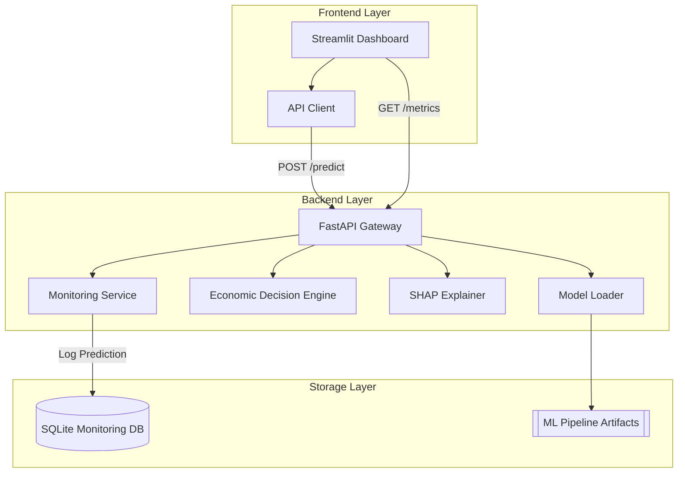

# System Architecture: Churn Intelligence Platform

This document outlines the high-level architecture of the Churn Prediction & Retention Optimization system.

## High-Level Overview

The system is designed as a modular, containerized ML application that bridges the gap between raw predictive modeling and business strategic action.

## Component Breakdown

### 1. Frontend Layer (Streamlit)
- **Dashboard**: Provides a premium UI for single and batch predictions.
- **Visualizations**: Uses Plotly for interactive risk analysis and system monitoring.
- **Dynamic Recommendations**: Translates ML probabilities into human-readable business advice.

### 2. Backend Layer (FastAPI)
- **FastAPI Gateway**: Handles request validation, routing, and error management.
- **Model Loader**: Singleton service that manages the lifecycle of the Scikit-Learn/XGBoost pipeline and SHAP assets.
- **Economic Decision Engine**: Decoupled logic that applies business thresholds (ROI, BRV) to model outputs.
- **SHAP Explainer**: Generates local feature importance for every individual prediction request.
- **Monitoring Service**: Tracks prediction distribution and feature drift in real-time.

### 3. Data & Storage
- **ML Artifacts**: Pickle files containing the calibrated pipeline and preprocessors.
- **Monitoring DB**: SQLite database used for persistent tracking of every prediction event and its economic outcome.

## Technical Stack
- **Languages**: Python 3.11
- **ML Frameworks**: Scikit-Learn, XGBoost, SHAP
- **API**: FastAPI, Pydantic, Uvicorn
- **UI**: Streamlit, Plotly
- **Ops**: Docker, Docker Compose, SQLite
