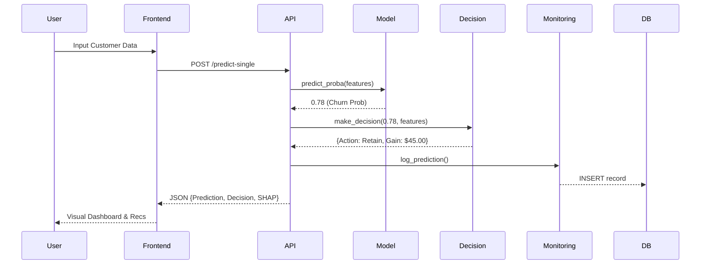

# System Design: Churn Intelligence Platform

This document describes the design principles, data flow, and key logic components of the system.

## Design Principles

### 1. Decoupled Economic Logic
The system treats ML predictions and Business Actions as two separate layers. The ML model predicts **probability**, while the Business Engine determines **action**. This allows business teams to adjust thresholds (ROI, retention costs) without retraining the model.

### 2. Calibrated Probabilities
Standard classifiers often output uncalibrated scores. This system employs a **Calibrated Classifier** to ensure that a 0.7 probability actually means a 70% risk, which is essential for accurate economic calculation.

### 3. Observability First
By using a persistent SQLite database to log every prediction, the system is designed for **post-hoc analysis**. This allows developers to audit why a decision was made and detect if incoming data distribution is drifting away from the training set.

---

## Data Flow

---

## Key Logic Components

### Economic Decision Engine
The core of the system's value is the `make_decision` logic:
- **BRV (Base Remaining Value)**: Estimates the remaining value of a customer if they don't churn.
- **Expected Gain**: `(Prob * BRV * Success_Rate) - Intervention_Cost`.
- **ROI**: The ratio of expected gain to cost.

### SHAP Explanability Loop
Every single prediction triggers a SHAP explanation in the background. This turns a "Black Box" model into a "Glass Box," providing the agent/manager with the top 3-5 reasons why this specific customer is at risk.

### Dockerized Orchestration
The system uses a two-tier container setup:
- **Backend Service**: Heavy ML dependencies (Scikit-learn, XGBoost).
- **Frontend Service**: Lightweight UI (Streamlit).
- **Volume persistence**: Ensures the SQLite monitoring database is not lost during service updates.
